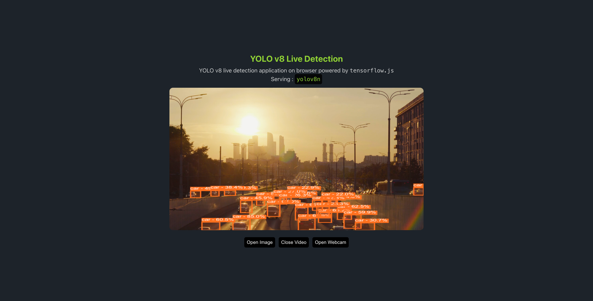
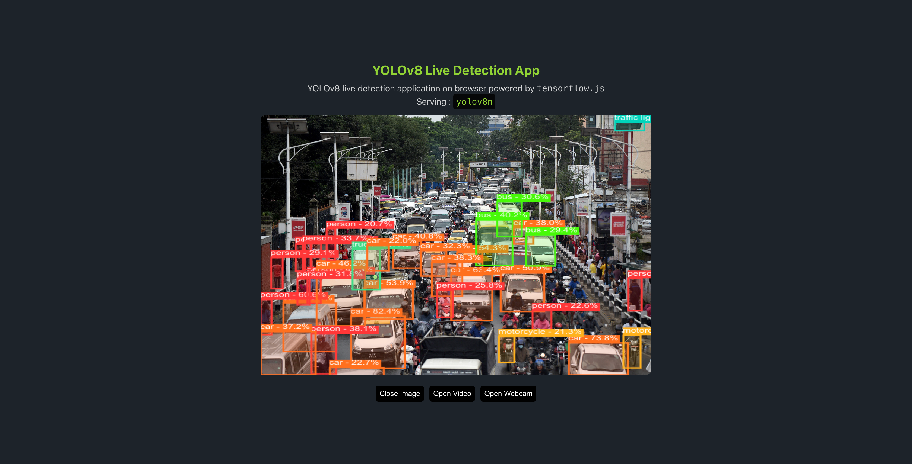
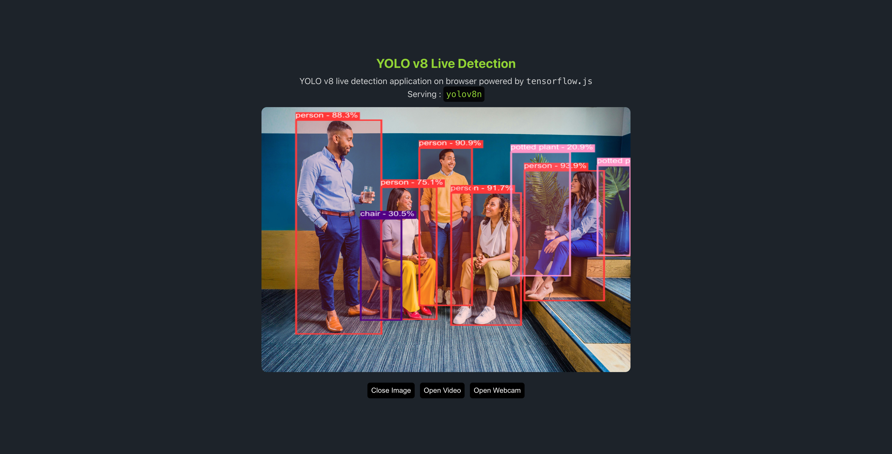
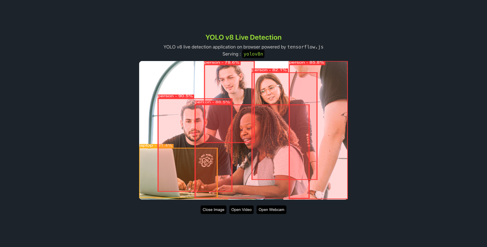
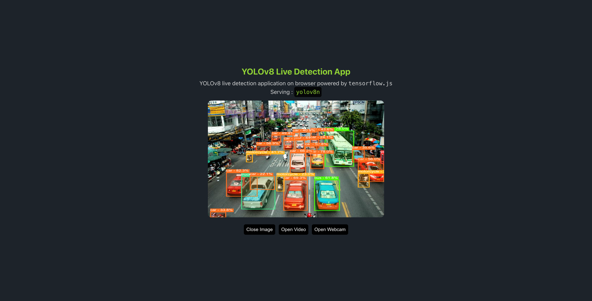
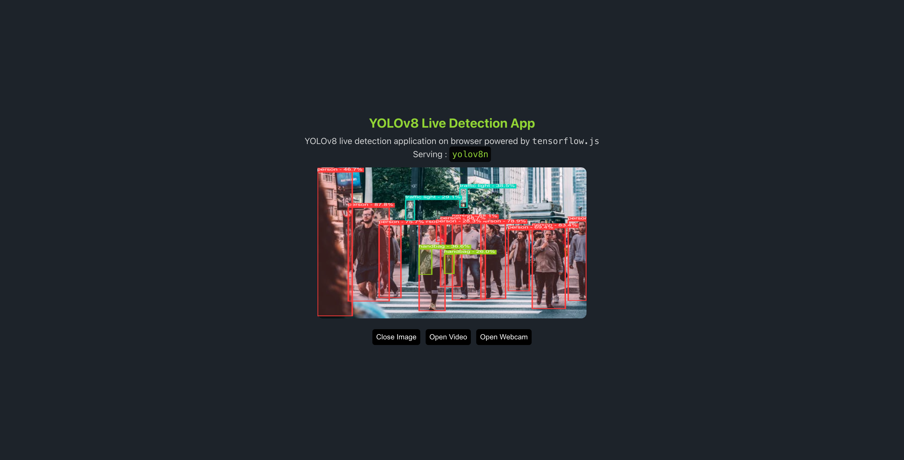
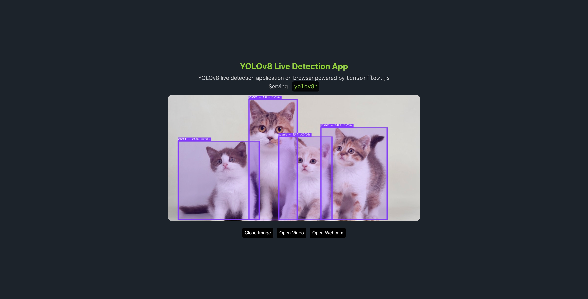

# Object Detection using YOLOv8 and Tensorflow.js

Features:

- Allows to upload photo, video or use camera to detect objects in 80 categories
- Yolo v8 models
- Vercel as deployment platform

